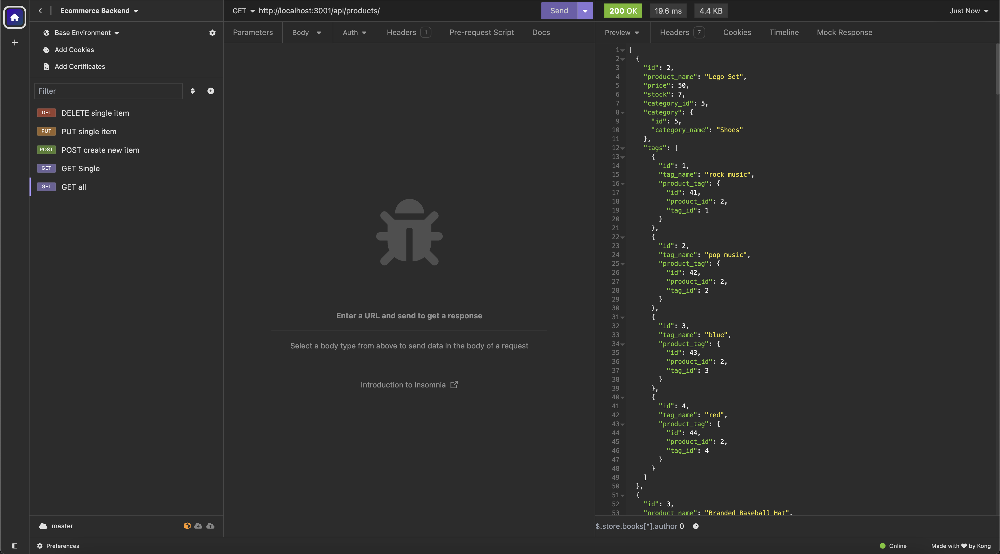

# ecommerce-backend

## Motivation

The motivation behind this project was to create a robust backend for an e-commerce site that can handle complex data relationships.

## Why This Was Built

This was built to provide a solid foundation for an e-commerce site, handling tasks such as product management, category management, and tag management.

## What It Solved

This project solved the challenge of managing complex data relationships in an e-commerce setting, such as associating products with categories and tags.

## What I Learned

Through this project, I learned how to use Sequelize to interact with a MySQL database and how to structure an Express.js API to handle various routes and data models.

## Table of Contents

- [Features](#features)
- [How to Use](#how-to-use)
- [Usage](#usage)
- [Technologies Used](#technologies-used)
- [Local Development](#local-development)
- [Deployment Link](#deployment-link)
- [Credits & Resources](#credits--resources)
- [License](#license)

## Features

- Product, Category, and Tag management via API endpoints
- Database synchronization using Sequelize
- Environment variable configuration for database connection settings

## How to Use

1. Clone the repository
2. Install dependencies with `pnpm install`
3. Seed the database with `pnpm run seed`
4. Start the server with `pnpm start`

## Usage

## Technologies Used

- Node.js
- Express.js
- Sequelize
- MySQL

## Local Development

To set up this project locally for development:

1. Clone this repository.
2. Install dependencies with `pnpm install`
3. Create a `.env` file and configure it based on `.env.EXAMPLE`
4. Seed the database with `npm run seed`
5. Start the server with `npm start`

## Demonstration Video

[Click here to go to video](https://youtu.be/9Xg-BknkBL4)

## Credits & Resources

- [Sequelize](https://sequelize.org/)
- [Express.js](https://expressjs.com/)
- [MySQL](https://www.mysql.com/)

## License

This project is open source and available under the [ISC License](LICENSE).
